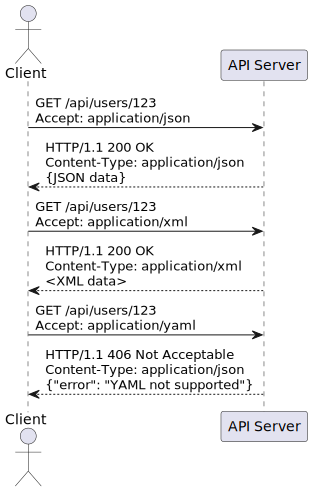
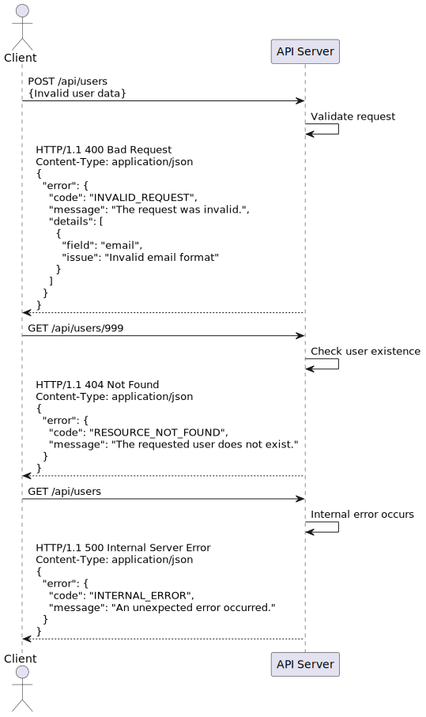

# REST and API Design Study Guide

## 1. Web Services and REST Architecture

### Definition of Web Services
Web services are software systems designed to support interoperable machine-to-machine interaction over a network. They allow different applications from different sources to communicate with each other without the need to write custom code.

### REST Principles
REST (Representational State Transfer) is an architectural style for designing networked applications. Its key principles are:

- **Stateless:** Each request from client to server must contain all the information needed to understand the request, and cannot take advantage of any stored context on the server.
- **Client-Server:** The client and the server should be separate from each other and allowed to evolve individually.
- **Cacheable:** Responses must be defined as cacheable or non-cacheable to prevent clients from reusing stale or inappropriate data in response to further requests.
- **Uniform Interface:** A uniform way of interacting with a given server irrespective of device or type of application (website, mobile app).
- **Layered System:** A client cannot ordinarily tell whether it is connected directly to the end server, or to an intermediary along the way.

### Advantages of REST over SOAP
- Simpler to use and more flexible
- Lighter weight (uses JSON)
- Faster (less processing needed)
- Closer to other web technologies in design philosophy and implementation

## 2. HTTP Methods and Resource Naming

### HTTP Methods
- **GET:** Retrieve a resource
- **POST:** Create a new resource
- **PUT:** Update an existing resource (by replacing it entirely)
- **DELETE:** Remove a resource
- **PATCH:** Partial update of a resource

### Status Codes
- **2xx (Success):** 200 OK, 201 Created, 204 No Content
- **3xx (Redirection):** 301 Moved Permanently, 304 Not Modified
- **4xx (Client Error):** 400 Bad Request, 401 Unauthorized, 404 Not Found
- **5xx (Server Error):** 500 Internal Server Error, 503 Service Unavailable

### URI Design Best Practices
- Use nouns to represent resources
- Use plural nouns for consistency
- Use hyphens to improve readability
- Use lowercase letters in URIs
- Don't use file extensions

### Resource Naming Conventions
- **Collection:** /users
- **Element in a collection:** /users/{id}
- **Sub-collection:** /users/{id}/orders
- **Element in a sub-collection:** /users/{id}/orders/{order_id}

### Idempotency in REST

Idempotency is a key principle in REST API design. An HTTP method is considered idempotent if multiple identical requests with that method have the same effect as a single request.

- **Idempotent methods:**
  - **GET:** Retrieving a resource multiple times doesn't change the resource.
  - **PUT:** Updating a resource with the same data multiple times results in the same state.
  - **DELETE:** Deleting a resource multiple times doesn't change the outcome after the first successful request.
  - **HEAD:** Similar to GET, but returns only headers, not the body.

- **Non-idempotent methods:**
  - **POST:** Creating a resource multiple times typically results in multiple resources being created.
  - **PATCH:** May or may not be idempotent, depending on the implementation.

### Importance of Idempotency

1. **Fault Tolerance:** Allows clients to safely retry requests without fear of unintended side effects.
2. **Network Reliability:** Helps manage issues like network failures or timeouts.
3. **Caching:** Idempotent methods are often more cacheable.

### Best Practices

- **Use PUT for full updates and POST for creation of new resources:**
  - **PUT:** Ideal for scenarios where the client can determine the resource's final state. Use PUT to update a resource entirely.
  - **POST:** Suitable for creating new resources when the server defines the resource's final state or when the client is adding a subordinate resource.

- **Implement idempotency tokens for non-idempotent operations when necessary:**
  - For operations like POST, where creating multiple resources accidentally is possible, using idempotency tokens ensures that the same resource is not created multiple times.

- **Design your API to be resilient to duplicate requests:**
  - Ensure that your API can handle multiple identical requests gracefully, without causing unintended side effects.
  - For example, in payment processing, using an idempotency key can prevent multiple charges from occurring if a request is retried.

### Examples of Idempotency in Practice

- **GET Example:**
  - Request: `GET /users/123`
  - Response: Returns user data for user with ID 123. Multiple identical requests will return the same data without modifying the user.

- **PUT Example:**
  - Request: `PUT /users/123`
  - Body: `{ "name": "John Doe", "email": "john@example.com" }`
  - Response: Updates the user data for user with ID 123. Repeated requests with the same body will result in the same state.

- **DELETE Example:**
  - Request: `DELETE /users/123`
  - Response: Deletes the user with ID 123. Subsequent identical requests will have no additional effect.


## 3. RESTful API Design and Versioning

### HATEOAS
Hypermedia as the Engine of Application State (HATEOAS) is a constraint of REST application architecture. It keeps the REST style architecture unique from most other network application architectures. The term "hypermedia" refers to any content that contains links to other forms of media such as images, movies, and text.

### API Versioning Strategies
- **URI Versioning:** /api/v1/users
- **Header Versioning:** `Accept: application/vnd.company.api+json; version=1.0`
- **Parameter Versioning:** `/api/users?version=1`


### Request/Response Formats
- **JSON (JavaScript Object Notation):** Lightweight, easy for humans to read and write, easy for machines to parse and generate
- **XML (eXtensible Markup Language):** More verbose than JSON, but can be more expressive
- **HTML (HyperText Markup Language):** Used for serving web pages
- **Plain Text:** Simple and useful for basic communication or logging
- **YAML (YAML Ain't Markup Language):** Human-readable data serialization standard that can be used for configuration files and data exchange
- **Protocol Buffers (Protobuf):** Language-neutral, platform-neutral, extensible mechanism for serializing structured data. Used by Google for internal APIs and more efficient than JSON or XML
- **CBOR (Concise Binary Object Representation):** Binary data serialization format which is efficient for both encoding and decoding

### Content Negotiation
RESTful APIs can support multiple formats through a mechanism called content negotiation, where the client and server negotiate the best format for the response. The client specifies the desired response format using the `Accept` header in the HTTP request, and the server responds with the appropriate format, specified in the `Content-Type` header of the HTTP response.

**Example of Content Negotiation:**

- Requesting JSON:
  ```http
  GET /api/users/123 HTTP/1.1
  Host: example.com
  Accept: application/json
  ```
- Requesting XML:

```http
GET /api/users/123 HTTP/1.1
Host: example.com
Accept: application/xml
```
- Response in JSON:
```http
HTTP/1.1 200 OK
Content-Type: application/json
```

- Response in XML:
```http
HTTP/1.1 200 OK
Content-Type: application/xml
```




### Pagination and Filtering
- Offset Pagination: /api/users?limit=20&offset=100
- Cursor-based Pagination: /api/users?limit=20&after=lastUserIdFromPreviousPage
- Filtering: /api/users?status=active&role=admin


### Error Handling in REST APIs
- Use appropriate HTTP status codes
- Provide error messages in the response body
- Include an error code for programmatic error handling
- Optionally include a link to error documentation

### Example error response:

```json
{
  "error": {
    "code": "INVALID_REQUEST",
    "message": "The request was invalid.",
    "details": [
      {
        "field": "email",
        "issue": "Invalid email format"
      }
    ]
  }
}
```


